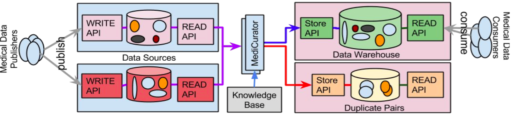

.. MediCurator documentation master file, created by
   sphinx-quickstart on Thursday, August 6.
   You can adapt this file completely to your liking, but it should at least
   contain the root `toctree` directive.

******************************************************************************
MediCurator : Near Duplicate Detection for Medical Data Warehouse Construction
******************************************************************************

Welcome to the MediCurator Documentation.
Here you will find information describing the features of the MediCurator platform,
tips on how to use it, and details about its RESTful API.

With the growing adaptation of pervasive computing into medical domain and
increasingly open access to data, near duplicate detection algorithms have been
proposed and implemented in order to detect and eliminate duplicate entries from
massive datasets.

Traditionally, near duplicate detection algorithms are sequential and operate on
a single computer. Now, InMemory Data Grids (IMDG) offer a distributed storage
and execution, giving the illusion of a single large computer over multiple
computing nodes in a cluster. However, common distribution strategy and framework
to parallelize the execution of the near duplicate detection algorithms is still
lacking.

MediCurator is a near duplicate detection framework for heterogeneous medical data
sources in constructing data warehouses. MediCurator has been developed to retrieve
medical data from various data sources, including MySQL, MongoDB, CSV files, and
medical image archives such as TCIA, and detect the duplicates in-memory, while
storing the merged data into data warehouses hosted in Hadoop Distributed File
System (HDFS).

This documentation is intended to serve both the MediCurator developers/deployers
as well as the MediCurator users.

Getting Started With MediCurator
################################

You may download and build MediCurator from its source code, which is readily avilable at

https://bitbucket.org/BMI/medicurator

The source code of this documentation can be found at,
https://github.com/Ireneruru/MediCurator-Readthedocs/tree/master/docs

This documentation is currently hosted at,
http://medicurator-readthedocs.readthedocs.io/

MediCurator Research
####################

.. toctree::
   :maxdepth: 2

   sections/Usecase
   sections/About-MediCurator

MediCurator Installation
########################

.. toctree::
   :maxdepth: 2
   sections/Installation

MediCurator for Users
##################

You can easily use MediCurator, because it is very user-friendly. It offers two main ways for you to choose, Rest API and Web-Application.

.. toctree::
   :maxdepth: 2

   sections/MediCurator-REST-API
   sections/Web-Application

MediCurator for Developers
#######################
MediCurator version 1.0 has extensively been developed for some specific environments while maintaining relevant interfaces for extension to the other conditions.

.. toctree::
   :maxdepth: 2

   sections/Data-Sources
   sections/Image formats

Citing MediCurator
##################

If you have used MediCurator in your research, please cite the below papers:

[1]Kathiravelu, P. & Sharma, A. (2016). Near Duplicate Detection for Medical Data Warehouse Construction.
In AMIA 2016 Joint Summits on Translational Science. March 2016.

[2] Kathiravelu, P. & Sharma, A. (2015). MEDIator: A Data Sharing Synchronization Platform for Heterogeneous Medical Image Archives. In Workshop on Connected Health at Big Data Era (BigCHat‘15), co-located with 21st ACM SIGKDD Conference on Knowledge Discovery and Data Mining (KDD 2015). Aug. 2015. ACM. 6 pages. http://doi.org/10.13140/RG.2.1.3709.4248

[3] Kathiravelu, P. & Sharma, A. (2016). SPREAD - System for Sharing and Publishing Research Data. In Society for Imaging Informatics in Medicine Annual Meeting (SIIM 2016). June 2016. http://c.ymcdn.com/sites/siim.org/resource/resmgr/siim2016abstracts/Research_Kathiravelu.pdf
