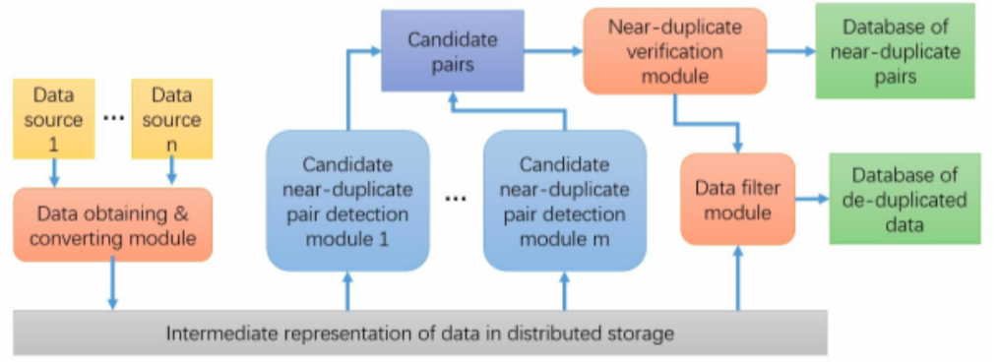
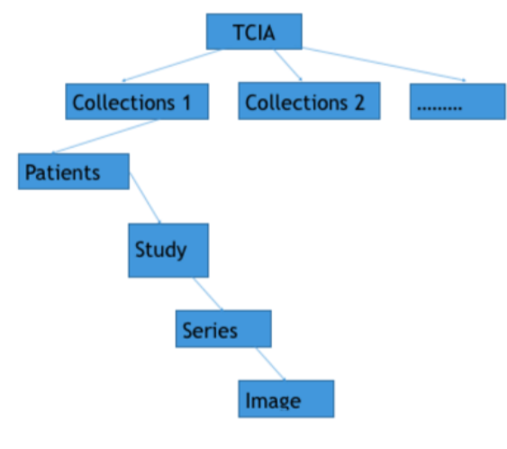
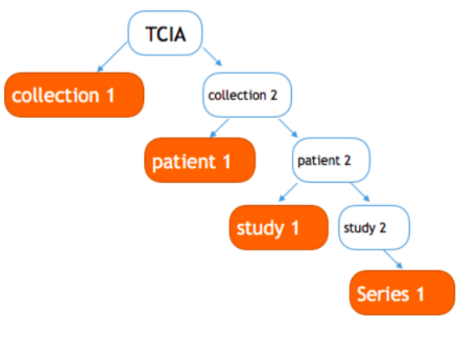

*******************************
Introduction to the MediCurator
*******************************

This page is intended to give an overall idea and the motivation behind the inception of MediCurator platform.

Introduction
############

Near duplicate detection algorithms have been proposed and implemented in order to detect and eliminate duplicate entries from massive datasets. Due to the differences in data representation (such as measurement units) across different data sources, potential duplicates may not be textually identical, even though they refer to the same real-world entity. As data warehouses typically contain data coming from several heterogeneous data sources, detecting near duplicates in a data warehouse requires a consider- able memory and processing power.

Traditionally, near duplicate detection algorithms are sequential and operate on a single computer. Now, In-Memory Data Grids (IMDG) offer a distributed storage and execution, giving the illusion of a single large computer over multiple computing nodes in a cluster. However, common distribution strategy and framework to parallelize the execution of the near duplicate detection algorithms is still lacking.

This paper presents the research, design, and implementation of MediCurator. MediCurator is a distributed near duplicate detection framework for heterogeneous medical data sources in constructing data warehouses. MediCurator has been developed to retrieve medical data from various data sources, including MySQL, MongoDB, CSV files, and medical image archives such as TCIA, and detect the duplicates in-memory, while storing the merged data into data warehouses hosted in Hadoop Distributed File System. As a unified near duplicate detection framework for big data, Medicurator efficiently distributes the algorithms over utility computers in research labs and private clouds and grids. 

Methods
#######

MediCurator integrates medical data from various heterogeneous medical data sources and private archives using the public APIs offered by the data sources, and curates the integrated data into a data warehouse for public access, while storing the detected duplicate pairs into a separate data source.

**Definition of the ReplicaSet**

Repliaset is the directory which contents the user's interested information.

A user can have many replicasets which serves for different researches. The information in a replicaset can be downloaded, detected near duplicate on and removed and so on. Also, a user can add any interested information of any data source into the replicaset. 

In one word, replicaset is a important operating unit which the user can do many operations on.

Below is the architecture of the MediCurator:

MediCurator detects the duplicates by analyzing the potential data pairs from the original data sources, using similarity matrices for textual data. It uses the hierarchical meta data attached to the binary medical data to identify, classify, and find duplicates among the binary raw data.

About the download tracking, Medicurator supposes all kinds of dataset are managed in a hierarchy manner for example, in TCIA , there are collections, Series and so on. Every hierarchy has a specific name to make it distinguished. Also, take the TCIA for example, there are collection name, SeriesID. So, all the dataset can be maintained in a tree structure. The leaf node repre- sents the data to be downloaded. Every replicate set is the set the subtrees. To be easily understood, we show an ex- ample - TCIAs replicate set collection 1, patient 1, study 1, series 1 shown in the picture fig 3. A download request will download all the data in a replicate set. To avoid download repeatedly, Medicura- tor creates a tree index for a user, initialize only have a root node - TCIA,as shown in fig 4. And then, some download flow begins, Medicu- rator dynamically adds the node to this tree. In this way, Medicurator can inspect the data we have down- loaded. Considering that Medicura- tor already has a tree recording the data it has downloaded, when it down- load other data afterwards, for exam- ple, if the user wants download col- lection 2, Medicurator recursively in- quires the child of this node, if pa- tients 1 has been downloaded, Medi- curator ignores it, and go to patient 2.

MediCurator is deployed as a cluster, built on Infinispan In-Memory Data Grid, such that it finds the similarity among the entries in an efficient parallel and distributed manner. Also, you can decide the storage that the MediCurator uses, the HDFS or the local storage. 

Due to its architecture, MediCurator offers a speed-up of ten-folds, compared to the existing solutions such as MPI systems.

Result 
######

MediCurator is a complete near duplicate metadata/image detection system with good robustness and high horizontal scalability, supporting medical image archives,MySQL, MongoDB, CSV files, and medical image archives such as TCIA and more kinds of data.
 
It can efficiently detect the duplicates，download the updated the images and avoid downloading the same information which has been downloaded before.

Discussion
##########

Data is published to various data sources by the medical data publishers through the respective write APIs of the data sources. 

MediCurator connects to the original data sources through their read APIs. It has multiple data sources providing the raw input data. Output is written to the data warehouse as well as the duplicate pairs stored in a separate data source, using the store APIs of the relevant data sources. Medical data consumers consume the data from the warehouse composed by MediCurator through its read API. The data warehouse is considered to be free from the duplicates, though false positives and false negatives may occur based on the effectiveness of the similarity matrices and similarity join algorithms used.

Conclusion
##########

MediCurator is a platform for distributed near duplicate detection that detects duplicate entries from multiple medical data sources when constructing a medical data warehouse by integrating those primary data sources. MediCurator functions as an integration middleware for data warehouse construction with duplicate detection and elimination, from the raw textual medical data, or the binary data by leveraging the meta data attached to it.
 
What’s more, it provides faster near duplicate detection over big data compared to the respective sequential execution of the algorithms, while enabling executions on massive datasets which would not have been possible to execute on utility computers. Although Medicurator has been developed for near duplicate detection for big data, it can be generalized for any data-intensive big data scenario as an adaptive distributed execution framework. 

