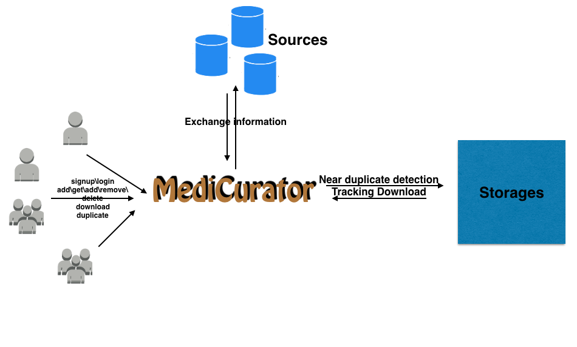

********
Use case
********

Data is published to various data sources by the medical data publishers through the respective write APIs of the data sources. MediCurator connects to the original data sources through their read APIs. 

Replica set
###########
Replica sets is the important concept that drives MediCurator.

A user can have plenty of Replica sets. The user can create it, name it, remove it, add datasets to it and detect duplicates between any two or more replica sets.

Research Use Case
#################
The researcher first decides source of the data and the storage of the information. These are necessary. Then he can perform some operations on MediCurator like the picture below.

The Cancer Imaging Archive (TCIA) encourages and supports cancer-related open science communities by hosting and managing the data archive, and relevant resources to facilitate collaborative research. Hence, MediCurator has been primarily implemented with TCIA to begin with.
 
Also, local file system has been implemented.

If you want to add other data source, you can easily extend it. More details can be found in MediCurator for Developers. 
